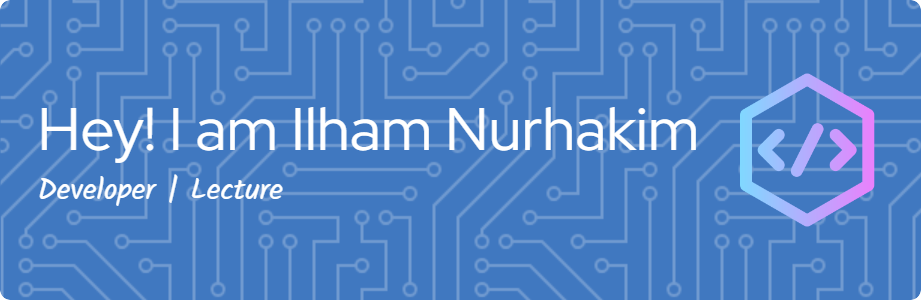

<!-- ## Hi there 👋 -->

### Hey! I am Ilham Nurhakim 👋

##### 🌐 Socials:

 

##### 💻 Tech Stack:

     

##### 📊 GitHub Stats:

 
 

##### 🏆 GitHub Trophies

##### 🔝 Top Contributed Repo

---

<!-- Proudly created with GPRM ( https://gprm.itsvg.in ) -->

<h2 align="left">Play Game With Me</h2>

###

###

<picture>
  <source media="(prefers-color-scheme: dark)" srcset="https://raw.githubusercontent.com/ilhamnurrhakim/ilhamnurrhakim/output/pacman-contribution-graph-dark.svg">
  <source media="(prefers-color-scheme: light)" srcset="https://raw.githubusercontent.com/ilhamnurrhakim/ilhamnurrhakim/output/pacman-contribution-graph.svg">
  
</picture>

###

